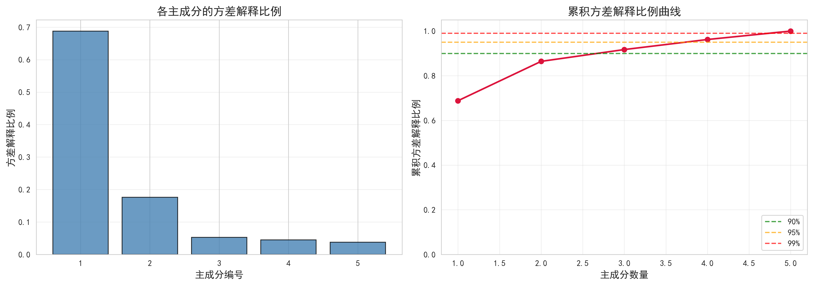
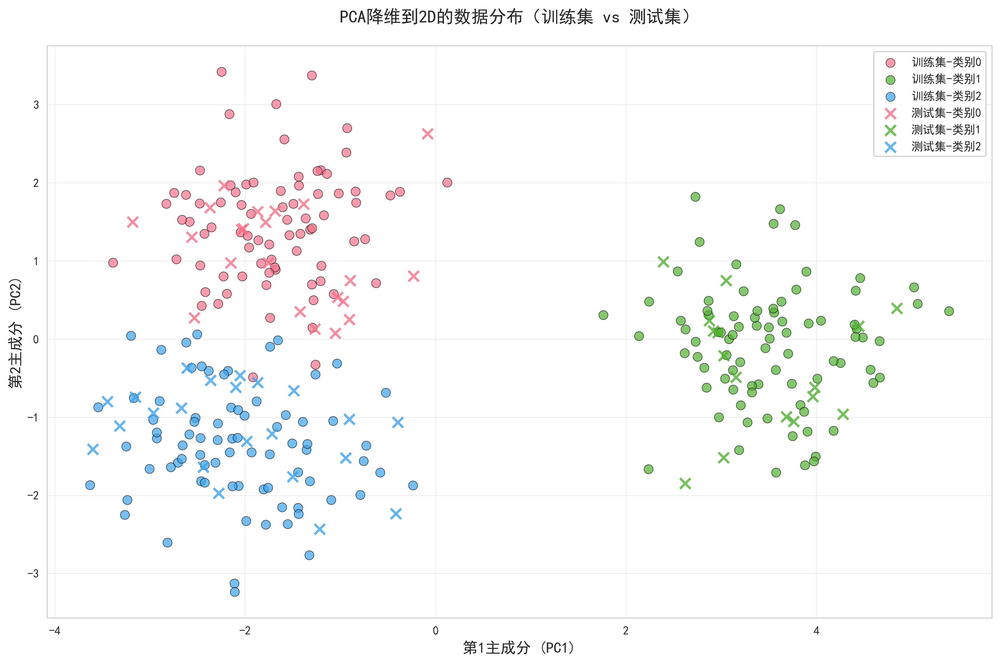
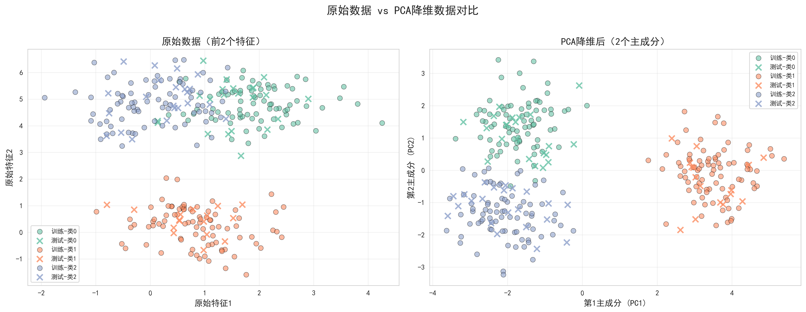

# 综合实验七：PCA主成分分析实验报告

## 一、实验原理

### 1.1 PCA核心思想
主成分分析（Principal Component Analysis, PCA）是一种经典的无监督降维方法。其核心思想是：通过线性变换，将原始高维数据投影到方差最大的若干正交方向上，从而在保留主要信息的前提下降低数据维度。

### 1.2 算法推导与公式

设原始数据矩阵为 $\mathbf{X} \in \mathbb{R}^{n \times d}$，其中 $n$ 为样本数，$d$ 为特征维度。

**步骤1：数据中心化**

$$\bar{\mathbf{x}} = \frac{1}{n}\sum_{i=1}^{n}\mathbf{x}_i$$

$$\tilde{\mathbf{X}} = \mathbf{X} - \mathbf{1}_n\bar{\mathbf{x}}^T$$

其中 $\mathbf{1}_n$ 是 $n$ 维全1向量。中心化将数据平移到原点，消除均值影响。

**步骤2：计算协方差矩阵**

$$\mathbf{C} = \frac{1}{n-1}\tilde{\mathbf{X}}^T\tilde{\mathbf{X}} \in \mathbb{R}^{d \times d}$$

协方差矩阵 $\mathbf{C}$ 是对称半正定矩阵，描述了各特征之间的相关性。

**步骤3：特征值分解**

对协方差矩阵进行特征分解：

$$\mathbf{C}\mathbf{v}_i = \lambda_i \mathbf{v}_i, \quad i=1,2,\ldots,d$$

其中：
- $\lambda_i$ 是第 $i$ 个特征值，表示该方向上的方差大小
- $\mathbf{v}_i$ 是对应的特征向量，表示主成分的方向
- 特征向量满足正交性：$\mathbf{v}_i^T\mathbf{v}_j = \delta_{ij}$

**步骤4：主成分选择**

将特征值按降序排列：$\lambda_1 \geq \lambda_2 \geq \cdots \geq \lambda_d \geq 0$

第 $i$ 个主成分的方差解释比例：

$$\rho_i = \frac{\lambda_i}{\sum_{j=1}^{d}\lambda_j}$$

前 $k$ 个主成分的累积方差解释比例：

$$\text{CVR}(k) = \sum_{i=1}^{k}\rho_i = \frac{\sum_{i=1}^{k}\lambda_i}{\sum_{j=1}^{d}\lambda_j}$$

选择前 $k$ 个特征向量构成投影矩阵：$\mathbf{W}_k = [\mathbf{v}_1, \mathbf{v}_2, \ldots, \mathbf{v}_k] \in \mathbb{R}^{d \times k}$

**步骤5：数据投影**

降维后的数据为：

$$\mathbf{Z} = \tilde{\mathbf{X}}\mathbf{W}_k \in \mathbb{R}^{n \times k}$$

这将 $d$ 维数据投影到 $k$ 维主成分空间（$k < d$）。

### 1.3 训练集与测试集的处理

PCA虽然是无监督方法，但需要从训练集学习两个参数：
1. **均值向量** $\bar{\mathbf{x}}_{\text{train}}$
2. **投影矩阵** $\mathbf{W}_k$

对于测试集 $\mathbf{X}_{\text{test}}$，降维过程为：

$$\mathbf{Z}_{\text{test}} = (\mathbf{X}_{\text{test}} - \mathbf{1}_{n_{\text{test}}}\bar{\mathbf{x}}_{\text{train}}^T)\mathbf{W}_k$$

**关键点**：测试集必须使用训练集的均值和主成分，否则两个数据集将处于不同的坐标系，无法比较。

## 二、实验步骤

### 2.1 数据加载
从 `.mat` 文件中加载数据：
- 训练集：$\mathbf{X}_{\text{train}} \in \mathbb{R}^{240 \times 5}$，$\mathbf{y}_{\text{train}} \in \mathbb{R}^{240}$，包含3个类别
- 测试集：$\mathbf{X}_{\text{test}} \in \mathbb{R}^{60 \times 5}$，$\mathbf{y}_{\text{test}} \in \mathbb{R}^{60}$

### 2.2 PCA实现流程
1. 计算训练集均值 $\bar{\mathbf{x}}_{\text{train}}$ 并中心化数据
2. 计算 $5 \times 5$ 协方差矩阵 $\mathbf{C}$
3. 对 $\mathbf{C}$ 进行特征分解，得到5个特征值和特征向量
4. 按特征值降序排列特征向量
5. 计算方差解释比例 $\rho_i$ 和累积方差 $\text{CVR}(k)$
6. 选择前 $k=2$ 个主成分构成 $\mathbf{W}_2$

### 2.3 数据降维
- 训练集降维：$\mathbf{Z}_{\text{train}} = \tilde{\mathbf{X}}_{\text{train}}\mathbf{W}_2 \in \mathbb{R}^{240 \times 2}$
- 测试集降维：$\mathbf{Z}_{\text{test}} = (\mathbf{X}_{\text{test}} - \mathbf{1}_{60}\bar{\mathbf{x}}_{\text{train}}^T)\mathbf{W}_2 \in \mathbb{R}^{60 \times 2}$

### 2.4 可视化分析
生成三张图像：
1. **方差解释比例图**：左图为各主成分的 $\rho_i$，右图为累积方差曲线 $\text{CVR}(k)$
2. **2D降维可视化**：在主成分空间 $(\mathbf{v}_1, \mathbf{v}_2)$ 中展示训练集和测试集的分布
3. **原始vs降维对比图**：对比原始特征空间和主成分空间的类别可分性

## 三、实验结果

### 3.1 方差解释比例分析

**关键发现**：
- **前2个主成分**：$\text{CVR}(2) = 86.44\%$
- **前3个主成分**：$\text{CVR}(3) = 90.18\%$
- **前4个主成分**：$\text{CVR}(4) = 95.73\%$
- **全部5个主成分**：$\text{CVR}(5) = 100\%$

这说明原始5维数据具有较高的冗余性，前2个主成分已能保留绝大部分方差信息，符合降维目的。

### 3.2 降维效果可视化

从图中观察到：
- **训练集与测试集分布一致**：实心圆（训练集）和叉号（测试集）在主成分空间中重叠良好，验证了PCA的泛化能力
- **类别可分性**：三个类别在 $(\mathbf{v}_1, \mathbf{v}_2)$ 空间中呈现较好的聚类结构
- **数据分布**：沿第一主成分 $\mathbf{v}_1$ 方向方差最大，符合PCA的优化目标

### 3.3 原始特征空间对比

对比分析：
- **左图（原始特征1-2）**：类别边界模糊，存在较多重叠区域
- **右图（主成分1-2）**：类别分离度明显提升，说明主成分方向 $\mathbf{v}_1, \mathbf{v}_2$ 比原始特征更好地捕捉了数据的判别信息

这验证了PCA不仅降维，还能通过线性变换增强数据的可分性。

## 四、实验心得

这次实验让我理解了PCA的一些使用价值和场景。首先是降维可视化，5维数据人眼看不懂，降到2维后就能画图直观观察，这对数据探索特别有帮助。其次是去除冗余，实验中5维数据用2维就保留了86%的信息，说明原始特征间有很强的相关性，PCA能自动找到"真正重要"的方向。

一个重要收获是理解了训练集和测试集的正确使用方法。虽然PCA是无监督的，但它也需要"学习"参数：均值和主成分方向。就像标准化要用训练集的均值和标准差一样，测试集必须用训练集学到的主成分去投影，否则两个数据集就不在同一个坐标系里了。

当然PCA也有局限：损失了13.56%的方差意味着有些信息被丢弃了，而且主成分是原始特征的线性组合，很难解释"第一主成分代表什么"。另外PCA只适合线性结构，如果数据是螺旋形这种非线性的，PCA就不行了。

总的来说，这次手动实现PCA让我真正理解了协方差矩阵、特征分解这些概念，比直接调sklearn的包收获大多了。

## 五、总结

本次实验通过手动实现PCA，我系统掌握了：
- **数学原理**：协方差矩阵、特征分解、方差最大化准则的推导
- **算法实现**：从数据中心化到投影的完整流程
- **工程实践**：训练-测试集正确使用、参数保存与复用
- **批判思考**：PCA的适用场景、局限性、与其他降维方法的对比

PCA作为降维的基石方法，虽然简单但思想深刻：通过线性变换找到数据的"主要矛盾"，舍弃"次要矛盾"。这种思想贯穿于后续学习的SVD、矩阵分解、自编码器等方法中，是理解现代机器学习的重要基础。
